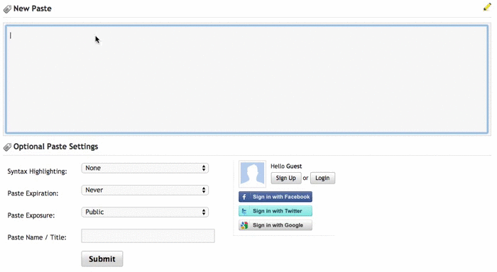

# InCrypt
> Encryption **you** control

## What is InCrypt?
InCrypt makes end-to-end encryption easy. It protects sensitive data by never storing your plain text on remote servers/websites. It automatically encrypts at point of entry and decrypts at point of retrieval. The website you are using never sees the raw data, only the encrypted version, so only you will see your data.

When you visit the page later, the content is then automatically decrypted.

## Chrome Extension

Currently we provide an experimental [Chrome extension](https://chrome.google.com/webstore/detail/incrypt/dpjkdfkiiifaeandmfhdklbfiljjippf) which automatically encrypts and decrypts content on certain sites. 

The extension currently supports automatic encryption and decryption on:

* [Pastebin](http://pastebin.com)
* [Gist](http://gist.github.com)
* [Gmail](https://mail.google.com/mail/#inbox?compose=new) (currently you can only send emails to yourself, as only you have the key).

## Installation

* Visit the [Chrome Web Store](https://chrome.google.com/webstore/detail/incrypt/dpjkdfkiiifaeandmfhdklbfiljjippf) to install the extension 
* Once installed, a pop-up will appear to enter your password
  * **NOTE**: For security reasons we don’t store your password, and therefore cannot recover your password if you lose it. We suggest you make a note of your password somewhere secure.
* Your personal private key will be generated and stored in encrypted form on your machine
  * If you have Chrome Sync enabled, the key will be available on all your Chrome installations

## Using InCrypt

### Pastebin 

* Head to [Pastebin](http://pastebin.com) and enter your text into the input box. 
* When you leave the input box, the text you entered will be encrypted.
* Click 'Publish' and you'll see the decrypted version of your text.

#### Demo

## Warnings

InCrypt is currently in alpha, and may have bugs or unexpected behavior. We do not recommend making InCrypt the sole storage location for sensitive data.

## What's planned for the future?

In future we aim to stabilise the API to enable people to build applications which take advantage of InCrypt for end-to-end encryption on their sites.

We'd also like to implement person-to-person encryption so that communications with others can be encrypted and decrypted. For example emails and instant messages.

Finally we'd like to add support for multiple browsers and mobile operating systems.

## Technical
### How It Works
When the extension detects InCrypt markup in HTML `<input incrypted="true"> </input>`, it automatically goes to work encrypting and decrypting content in those elements.

If you want to included InCrypt support on your site, simply ensure that any `<input>` or `<textarea>` has this attribute applied. The InCrypt extension will then take care of the rest!

## Contact Us

We'd love to hear from you! 

If you have any thoughts / improvements or would like to build an application or example which uses InCrypt you can:

* [Create an issue](https://github.com/incrypt/incrypt/issues/new)
* [Email us](mailto:incrypt@googlegroups.com)
* Reply to us on [Reddit](http://reddit.com)
